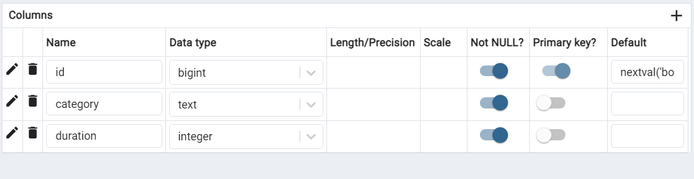

# Booking System

The Booking System is a Java application that allows users to make, cancel, and prolong booking orders. It follows SOLID principles and uses PostgreSQL as the database for data storage.

## Prerequisites

Before running the application, make sure you have the following installed on your system:

1. Java Development Kit (JDK) 8 or higher
2. PostgreSQL database server (running locally or with access credentials)
3. Intellij IDEA or other IDE to run and edit your code
## Getting Started

Follow the steps below to get the Booking System up and running on your local machine:

1. Clone the repository:

```bash
git clone https://github.com/Mirassik/OOP_Assignment.git
cd booking-system
```

2. Open in IDE

3. Database Setup:

    - Create a new database named `booking_system_db` in your PostgreSQL server.
    - Create such columns 
    - Set up the database connection properties in `src/Main.java` (example):
    
      ```
      url=jdbc:postgresql://localhost:5432/booking_system_db
      username=your_database_username
      password=your_database_password
      ```

3. Run ```src/Main.java``` file in IDE.